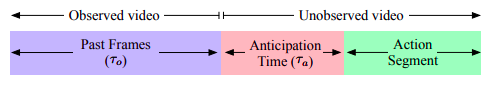

# Anticipative Video Transformer

Action Anticipation task: 
> Anticipation of future actions in a video (CVPR EpicKitchens Challenge). 

[paper](https://arxiv.org/abs/2106.02036), [github](https://github.com/facebookresearch/AVT)

## Novelty
- End-to-end, purely attention based architecture for predictive video modeling.
- Self-supervised future prediction loss

#### Dataset: EpicKitchens-x Dataset

## Problem setup

For each action segment labeled in the dataset starting at time **τs**, the goal is to recognize it using a **τo** length video segment **τa** units before it. While methods are typically allowed to use any length of observed segments **(τo)**, the anticipation time **(τa)** is usually fixed for each dataset.

## Architecture

### Backbone Network (AVT-b)

1. **Identical to ViT-B/16**
2. **Input**: 
	- Each input frame is split into 16x16 patches.
	- These patches are then flattened to a 256D vector which is then mapped to a 768D space used in the encoder.
	- The [class] token is prepended to the patch embeddings.
	- Spatial position embeddings are added to each patch embedding
	- Can be trained on L-length clips instead of individual frames.
3. Is pluggable for different feature representation methods (we can do the same).

### Head architecture (AVT-h)

1. **Input**: Output of the [class] token from AVT-b is used as input to the head architecture
	1. Temporal positional embedding based on absolute frame position is added to each frame feature.
2. **Decoder**: Normal causal decoder (masks future frames as task is predicitve) 

## Training
1. We sample a clip  ending **τa** seconds before the start of the action. It is then passed to the AVT to obtain future predicitions.
2. 3 losses used :

- Supervised loss for next action predcition - cross entropy over all classes.

- Self-supervised loss b/w predicted feature and true feature (L2 loss).

- Any action segment that overlaps with the current input feature - corss entropy over all classes.
	

3. 10 frames at 1FPS
4. AVT-b weights are initialized from a model pre-trained on ImageNet datasets (we can do that) amd then fine-tuned on the anticipative task (on EpicKitches I'm assuming).

