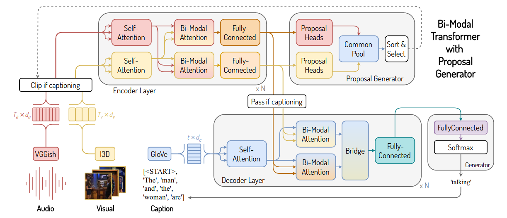
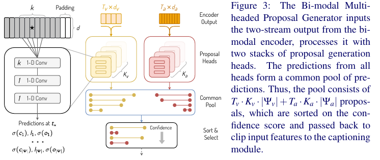

# A Better use of Audio-Visual Cues: Dense Video Captioning with Bi-modal Transformer

Dense Video Captioning: 
> First localize the events, and then produce one-sentence descriptions of each of them. 

[The paper.](https://arxiv.org/abs/2005.08271)

## Novelty
- ***Bi-modal transformer*** with ***multi-head proposal generator***.
- In the transformer architecture, attention is used to fuse the two input sequences.
- YOLO inspired proposal head for multi-head proposal generator.

#### Dataset: 
* ActivityNet Captions Dataset

#### Performance
* SOTA performance with BLEU@3-4 for DVC 
* SOTA performance with F1 metrics for proposal generation

## Architecture

1. **Input**: continuous features stacked in a sequence.
	1. Visual: Inflated 3D network (I3D)
	2. Audio: VGGish
	3. Tokens: GloVe
2. **Encoder**: Both feature sequences are self-attended and then passed through $N$-layered encoder to produce *bi-modal sequence representations* using novel *bi-modal multi-headed attention* blocks to fuse features from both sequences. 
3. **Proposal Generator**: Uses the representations output from encoder to generate proposals and their confidence scores. 
4. A pre-defined number (top) proposals are selected to **clip** the input feature sequences. 
5. **Encoder**: Re-represents clipped features (since some features have been removed, a representation needs to be calculated again).
6. **Decoder**: The encoder's outputs are passed to the bi-modal attention blocks in every decoder layer, along with the representation of previously generated caption words.
7. **Caption Generator**: Last layer representation of the decoder is used to generate the next word. 
Start token is used as the first caption token (otherwise it would be empty), and the caption is generated word-by-word until end token is sampled.

## Captioning Module
### Goal
Produce a caption for each proposal given to it.

### Flow
1. Bi-modal Encoder takes in audio feature sequences A and video feature sequences V, which correspond (temporally) to to a proposal.
2. Bi-modal Encoder outputs $A^v$ (video attended audio features) and $V^a$ (audio attended video features).
3. Bi-modal Decoder 
	1. uses previous caption words ($c_1$, $c_2$, $c_3$, ..., $c_{t-1}$), self-attends them, 
	2. then carries out bi-modal attention of $c_{t-1}$ with $A^v$ and $V^a$.
	3. Then there's a bridge (?)
	4. Position-wise (to encode order info) fully-connected layers
4. The final representation of the Decoder is used to model the distribution of the next caption word, over the vocabulary ==> FC layer with softmax.

### Other stuff
There are Normalization layers and dropout at some places

## Event Generation Proposal Module
### Goal
Generate a set of proposals, given a video.

### Flow
It consists of two parts:
- Bi-modal encoder
- Bi-modal multi-headed proposal generator

1. Entire sequence is input to bi-modal encoder
2. In the bi-modal encoder, 
	1. Self-attention for audio, video
	2. $A^v$ and $V^a$ are calculated
3. The final encoder representation of the two modalities $A^v$ and $V^a$ are then given to the Proposal Generator:
	* The two modalities may have different dimensions with respect to the time duration (sequence length) (*does this mean they are not necessarily in sync?*). Hence they are not fused here, but instead there are two distinct sets of proposal generator heads, one set for each modality. Hence, for each modality individually, the predictions are made at every time step, forming a "common pool of cross-modal predictions".
	* Inspired by YOLO and RPN ([Convolutional layers with anchor boxes](https://arxiv.org/abs/1612.08242)):
        * Anchors, calculated apriori, by running K-Means Clustering on the ground truth event lengths (1D). Each centroid of a cluster is taken as an anchor in the anchor set $\psi$.  The distance metric used is the Euclidean distance, while YOLO uses IoU.
	    * Predictions: Temporal boundaries, and confidence scores are found by the three values predicted by proposal head: center, length, confidence. Temporal boundaries are calculated using center and length. 
	    * $$center = p + \sigma(c)$$
            $$length = anchor\_length \cdot exp(l)$$
            $$confidence = \sigma(o)$$
            Here, $p$ is the position of grid cell (position in sequence). The network predicts $c$, $l$ and $o$. Refer the [YOLOv2 paper](https://arxiv.org/abs/1612.08242); this is the 1D version of it. The sigmoid function constraint is used for the center so that network is more stable and learning becomes easier.
        * Each proposal head has three 1D convolutional layers. Through these layers, the sequence length is preserved using padding and stride=1.
            * The first layers in each head have different kernel size $k$ from sets $K_a$ and $K_v$.
            * The sets $K_a$ and $K_v$ are calculated apriori by running K-Means Clustering on ground truth event lengths; the idea is to match receptive field sizes with the event sizes.
            * The next two layers of each head have kernel size=1. 	
4. Select the top 100 (by confidence score) from common pool of proposals.

The loss for the center $c$ and log coefficient $l$, *Localisation error*, is Mean Squared Error (MSE).
The confidence loss is the weighted sum of Binary Cross Entropy (BCE) of objectness and no objectness loss.

## Training
1. First, captioning module is trained with ground truth proposals.
2. Proposal Generator is then trained using the now trained bi-modal encoder from captioning modules.
3. Captioning Module Loss: KL-divergence, with Label Smoothing
4. Proposal Generator Loss: Each proposal head uses MSE for localization and cross-entropy for objectness (proposal or not) loss. Ref YOLO.

## Code Explanation
### Classes
* `ProposalGenerationHead`: One head, with given kernel_size (of the first Conv1D layer). Independent of modality
* `ProposalGenerator`: ProposalGenerator for *one*, *specifiable* modality (audio or video). Uses multiple *ProposalGeneratorHead*s in its `forward` method, and concatenates their output as the overall output of the proposal generator.
* `MultimodalProposalGenerator`: Same as ProposalGenerator, but handling multiple (two for now) modalities. Maybe this could actually be combined with ProposalGenerator as one class, like a general NModalProposalGenerator*

### `ProposalGenerationHead`
* 3 Conv1D layers, with the first layer having `kernel_size=k`, other two having `kernel_size=1`. All layers have `stride=1`, and the first layer has `padding=kernel_size//2` to cover all grid cells. Also why an odd `k`  is preferred.
* ReLU, Layer normalization and dropout between layers
* For every layer normalization and convolution, transpose needs to be taken, this is because these operations need to be applied on the sequence dimension, and in the input, the sequence (of video features) dimension is the second dimension, not third.
	* B: batch_size, S: sequence len (of video features), D: feature dimension
	* Original: (B, S, D). Since S dimension needs to be convolved over, it needs to be (B, D, S). See the `ProposalGenerationHead.forward` method. In fact, the `blocks.Transpose` class should be used here too.
	* Similar (*anti-symmetrical?*) for Layer Norm. Its input should be (B, S, D) to normalize over the D dimension (feature dimension), but due to Conv1D layers, the shape being convolved is (B, D, S). Hence a transpose is required here.
* In `ProposalGenerationHead.forward`, the line `x = self.fc_layer(x)` is suspiciously commented.

### `ProposalGenerator`
* Handles one modality for an instance
* Final layer dimension of each head: (B, S, A, 3) --> batch_size, sequence len, anchors_num, 3 (`c`entre, `l`og coefficient, `o`bjectness score)
* `forward` consists of:
	* Linear embedder (`blocks.FeatureEmbedder`) (optional, only point I see is to convert feature dimension to that what the detection layer expects)
	* Positional Encoder (`blocks.PositionalEncoder`): to encode order information in the features
	* Encoder: *The* encoder, i.e. the encoder block of the captioning module. If the encoder is pre-trained, a path is to be supplied, and that encoder is used. Otherwise, a new encoder is initialized (maybe for "*Separate*" training (refer *4.2, Training Procedures*)).
	* Detection layer (`ProposalGenerationHead`s, one for each of the kernel sizes)
* Binary Cross entropy loss for objectness / confidence, and MSE loss for localisation (center and log coeff (len)).
* `kernel_size_forward` method is the forward method for one head (i.e. one kernel size). It takes the head to be applied (frustratingly called `layer`) and carries out the forward prop through the head. 
	* Output dim: (B, S, D) --> (B, S, A, 3)
	* After this, it calculates $\sigma(c)$ and $\sigma(o)$.  c is `[:, :, :, 0]`, l is `[:, :, :, 1]`  and o is `[:, :, :, 2]` (called the logits).
	* Then it calculates the predictions (center position, length of proposal, confidence) using the formulae.
	* If training (`targets` are specified), then the losses are calculated. To calculate losses, the ground truth proposals are first converted into a form ("`obj_mask, noobj_mask, gt_x, gt_w, gt_obj`") using the `make_targets` function.

### `MultimodalProposalGenerator`
* Very similar to `ProposalGenerator`, except it is bimodal. It does the Linear Embedder and Positional Encoder for both modalities separately. Then it uses the `BiModalEncoder` instead of `Encoder`.
* It has two `detection_layers`: one for A and one for V.
* Its `forward_modality` is same as (the counterpart of) `ProposalGenerator.kernel_size_forward` (almost verbatim)
* In the `forward` method, the two modalities output from `self.encoder` (which is a `BiModalEncoder`) is `(Av, Va)` (attention).

#### `make_targets`
This is a function to convert ground truth proposals to a form that can be compared with predictions to compute the losses. TODO.