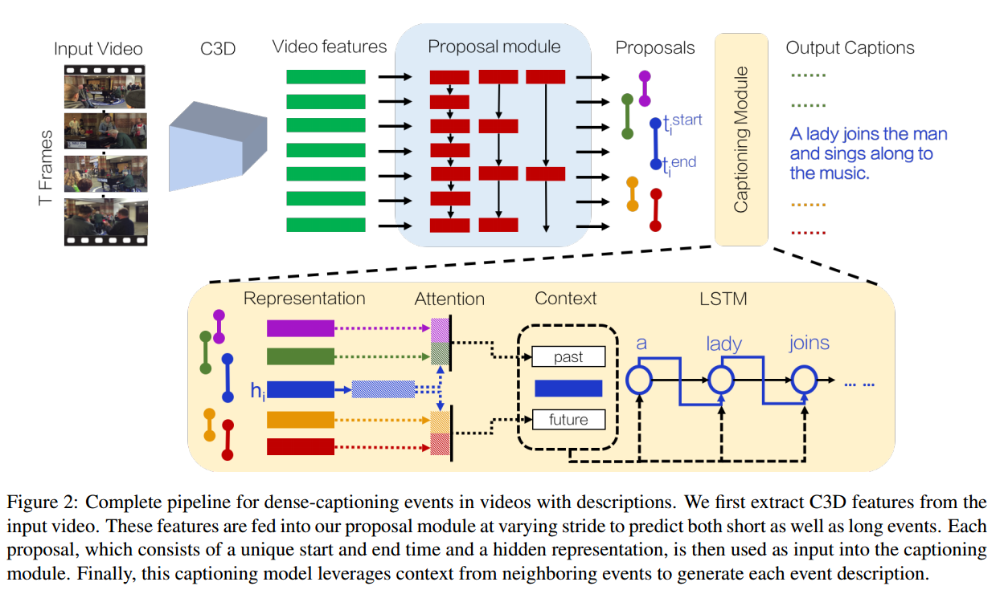
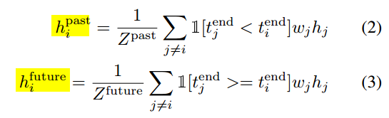

# Dense-Captioning Events in Videos

> Introduced DVC and ActivityNet Captions dataset. Architecture inspired by DAPs.

[The paper.](https://arxiv.org/abs/1705.00754)
 - **Authors**: Ranjay Krishna, Kenji Hata, Frederic Ren, Li Fei-Fei, Juan Carlos Niebles
 - **Published**: May 2017

<!-- TABLE OF CONTENT -->
## Table of Content
- [Dense-Captioning Events in Videos](#dense-captioning-events-in-videos)
  - [Table of Content](#table-of-content)
  - [Introduction](#introduction)
  - [Architecture](#architecture)
    - [Problem Formulation](#problem-formulation)
    - [Event Proposal Module](#event-proposal-module)
    - [Captioning Module with context](#captioning-module-with-context)
  - [Experiments](#experiments)

<!-- Introduction -->
## Introduction
* Dense video captioning
* Aims to tackle following challenges: 
  * overlapping events and events with varying time scale
  * utilize context from past and future for caption generation (can use only past context for streaming networks)
* Uses video frames and training in **alternative manner**
* Project page: [stanford/densevid](https://cs.stanford.edu/people/ranjaykrishna/densevid/)

<!-- Architecture -->
## Architecture

<!-- Problem Formulation -->
### Problem Formulation
* Input: sequence of video frames v = {vt} ... (t = 0, ... ,T-1)
* Proposal module output: P = (tistart, tiend, scorei, hi) ... (hi = hidden state from LSTM)
* All proposals with score higher than threshold are forwarded to language model 
* Captioning module uses context and output: si = (tistart, tiend, {vj}) ... (vj word from Vocabulary set) 

Architecture - 
* **Event Proposal Module**: Detecting events in short as well as long video sequences
* **Captioning Module with context**: Describing each event

<!-- EventProposalModule -->
### Event Proposal Module

* C3D features of video frames (every 16 frames)
* Features fed into variant of DAPs - sampling video at different strides (1, 2, 4, 8) and feeding it to LSTM
  * Longer strides capture longer events
* Outputs K proposals at every timestamp, strides computed in parallel
* For every event detected, hidden state of the LSTM at that time stamp is used as feature representation for captioning (hi)

<!-- CaptioningModuleWithContext -->
### Captioning Module with context

* For every event, concatenation of (hipast, hi, hifuture) is fed as input to captioning LSTM (attention for concatenation)

<!-- Experiments -->
## Experiments
* Evaluated on ActivityNet Captions with BLEU@N, METEOR and CIDEr metrics
* Compared with LSTM-YT, S2VT and H-RNN by supplying them ground-truth proposals
* Different versions of model - no-context, only past, full-context, w/o attention concatenation
* Attention proved useful for longer videos, high overlapping events resulted in repeated captions
* Evaluated for the task of video and paragraph retrieval too