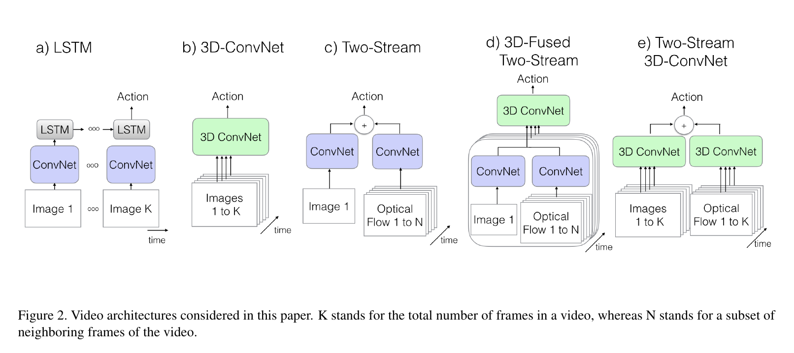
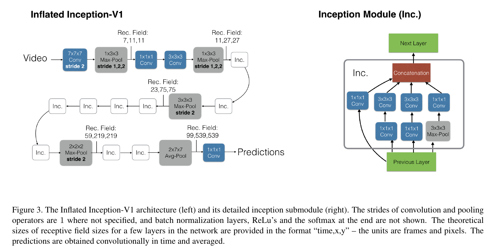

# Quo Vadis, Action Recognition? A New Model and the Kinetics Dataset
This paper introduces a new model: Two-Stream Inflated 3D Convnet (I3D) for the task of action recognition. But more importantly, it addresses the following points:
* 2D kernels (images, sequenced)  v/s 3D kernels (video)
* Just RGB input of the video or (pre-computed) optical flow too
* When using 2D ConvNets, how information is propagated through frames (time)
* Whether transfer learning (training on one dataset, for some task, and then applying the pre-trained network on another task by possible fine-tuning on another dataset) has benefits for video tasks

The paper compares the following models on the following task: Pre-training on Kinetics dataset and then fine-tuning on [HMDB-51](https://paperswithcode.com/dataset/hmdb51) and [UCF-101](https://paperswithcode.com/dataset/ucf101) datasets.

#### ConvNet + LSTM
Using successful image classification networks only, features are extracted from each frame of the video and predictions are (independently) pooled across the whole video. This architecture completely ignores the temporal structure of the video, i.e. notions of *before-after*, *forward-backward in time* are not learned. Temporal structure is important for captioning events.

If we add a recurrent layer (e.g. LSTM) to this model, state can be encoded and temporal structure can be captured, along with long-term dependencies.

#### 3D ConvNet
Instead of standard 2D ConvNets, we use ConvNets with **spatio-temporal** filters. They are able to directly create hierarchical representations of spatio-temporal data (videos in this case). But because of an additional kernel dimension, 
* They have many more parameters than 2D ConvNets, making them much harder to train
* We also cannot make use of pre-trained networks (e.g. on ImageNet)

Due to these reasons, previous work with 3D ConvNets are mostly involve shallow architectures, trained from scratch.

#### Two-Stream Networks
Capturing low-level motion using LSTMs after last layers of ConvNets is very expensive to train as it requires unrolling the network through multiple frames.

In this architecture, short temporal snapshots are modeled by averaging predictions from a single RGB frame and 10 optical flow frames, after these two *streams* are passed through identical ConvNets (pre-trained on ImageNet). Multiple such snapshots are sampled from the video and action prediction is averaged. This architecture is very efficient to train and test.

An extension to this involves fusing spatial and optical flow strams after the last convolutional layer.

#### Two-Stream Inflated 3D ConvNets (I3D)

##### Inflating 2D ConvNets into 3D
The trick this architecture employs is to simply convert 2D ConvNets (successful ones, pre-trained on ImageNet) into 3D ConvNets. This conversion is done by *inflating* filters and pooling kernels, i.e. adding a temporal dimension to them. Hence filters go from 2D to 3D.

##### Bootstrapping 3D filters from 2D filters
The parameters from successful ImageNet models can be used directly in the I3D ConvNet. 
>  To do this, we observe that an image can be converted into a (boring) video by copying it repeatedly into a video sequence. The 3D models can then be  implicitly pre-trained on ImageNet, by satisfying what we call the boring-video fixed point: the pooled activations on a boring video should be the same as on  the original single-image input. This can be achieved, thanks to linearity, by repeating the weights of the 2D filters N times along the time dimension, and rescaling them by dividing by N . This ensures that the convolutional filter response is the same.

##### Receptive Field
The *boring video fixed-point* allows freedom on choosing how to inflate pooling operators along the time dimension and on choosing temporal stride.
Compared to image models, symmetric receptive fields ($F \times F$) are not optimal when considering the time dimension. The frame rate should be considered. If the field grows too quickly in time relative to space, edges from different objects might get combined, which would lead to poor features in the initial part of the model. If it grows too slowly, the scene dynamics might not be captured well.

##### Two 3D Streams
A 3D ConvNet can learn features just from RGB input, but using optical flow too is found to be helpful. This is because with RGB input, pure feedforward computation is performed, but optical flow algorithms have some recurrence.

Hence, similar to Two-Stream networks, a two-stream configuration - one I3D network for RGB, one for optical flow. The two networks are trained separately and their predictions are averaged.

#### TODO
- [ ] Implementation details: Inception
