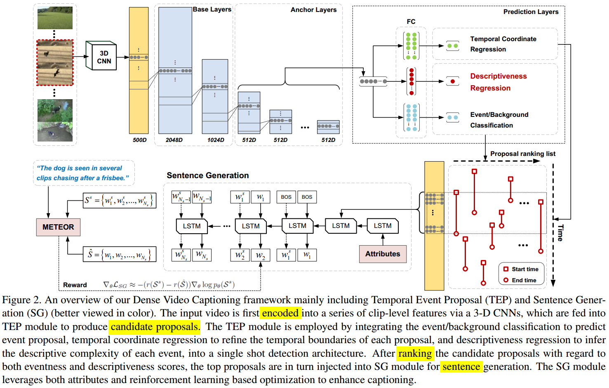
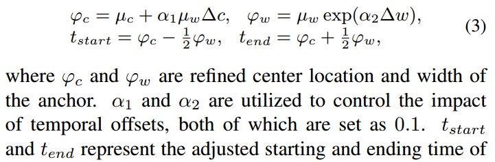

# Jointly Localizing and Describing Events for Dense Video Captioning

> Event proposal and sentence generation in end to end manner. Introduces descriptiveness score and eventness score.

[The paper.](https://arxiv.org/abs/1804.08274)
 - **Authors**: Yehao Li, Ting Yao, Yingwei Pan, Hongyang Chao, Tao Mei
 - **Published**: April 2018

<!-- TABLE OF CONTENT -->
## Table of Content
- [Jointly Localizing and Describing Events for Dense Video Captioning](#jointly-localizing-and-describing-events-for-dense-video-captioning)
  - [Table of Content](#table-of-content)
  - [Introduction](#introduction)
  - [Architecture](#architecture)
    - [Problem Formulation](#problem-formulation)
      - [TEP Module](#tep-module)
      - [SG Module](#sg-module)
  - [Experiments](#experiments)

<!-- Introduction -->
## Introduction
* End to End: Global optimization of Temporal event proposal and sentence generation
* Architecture inspired from object localization networks (Output - Temporal coordinates, Descriptiveness score, Eventness score)
* LSTM optimized with Reinforcement learning for sentence generation (Uses descriptiveness score and categories from ActivityNet classes)

<!-- Architecture -->
## Architecture

<!-- Problem Formulation -->
### Problem Formulation

* Given video $V$ with $T_v$ frames, generate {tstart, tend, sentence}1N
  * N: Total number of proposals
* Two Modules in architecture:
  * Temporal Event Proposal(**TEP**) Module: Generate Candidate proposals
    * *Input*: Video frames
    * *Output*: {tstart, tend, pevent, pdes}1$N_p$
      * $N_p$: Total number of candidate proposals
      * pevent: probability of recognizing the candidate as an event (i.e., eventness score). 2D vector - [pevent, pbackground]
      * pdes: descriptiveness score measuring how well the candidate can be described from language perspective
  * Rank proposals based on **pconf = pevent + $λ_0$pdes**
  * Sentence Generation (**SG**) Module: Generate captions for final proposals
    * Input:
      * A - Attributes from 200 categories of ActivityNet dataset
      * F - Encoded representation of frames in that proposal (weighted attention using descriptiveness score)
    * Output: Sentence describing that proposal

<!-- TEP Module -->
#### TEP Module
* Encode video frames using 3D-CNN
* Encode $v_t$ : $v$t+δ (δ = 16 in paper), and temporal interval is set as 8
  * Encode $v_1$:$v$16, $v_8$:$v$24, ...
* $T_f$ = $T_v$ / 8
* Feature map of size $T_f$X$D_0$ is fed into 1D CNN architecture, Base layers, anchor layers and prediction layers
  * *Base* - devised to reduce the temporal dimension of feature map and increase the size of temporal receptive fields, producing the output feature map of size $T_f$ = 2 X 1024
  * *Anchor* - stacked nine anchor layers (conv3 to conv11) on the top of base layer conv2, each of which is designed with the same configuration (kernel size: 3, stride size: 2, and filter number: 512). These anchor layers decrease in temporal dimension of feature map progressively, enabling the temporal event proposals at multiple temporal scales
  * *Prediction* - given an output feature map from anchor layers of size $T$$f_j$X$D_j$, output from 1X$D_j$ - {pcls, ∆c, ∆w, pdes}
    * pcls - [pevent, pbackground]
    * pdes - descriptiveness score to infer the confidence of this proposal to be well described
    * ∆c and ∆w are two temporal offsets relative to the default center location $µ_c$ and width $µ_w$ of this anchor
    * Temporal coordinates given by - 
    * **DOUBT** - Default temporal boundaries
* **Training** - 
  * positive sample if tIoU > 0.7
  * *Loss*: $L$$TEP$ = $L$$event$ + $αL$$ctr$ + $βL$$des$
  * Formulas for each loss can be referred from the paper

<!-- SG Module -->
#### SG Module
* Each proposal is injected into attribute-augmented LSTM
* Firstly the attributes representation **A** of predicted proposal $φ$$p^$ is transformed into LSTM to inform the whole LSTM about the high-level attributes, followed by the proposal representation **F** which is encoded into LSTM at the second time step
* Then, LSTM decodes each output word based on previous word and previous step’s LSTM hidden state
* For each proposal, **F** is the weighted sum of frame representations where weights are determined using their descriptiveness score
* **Training** - 
  * Inspired from reinforcement learning, LSTM is optimized using minimizing the expected sentence-level reward loss

**End to end loss** - $L$ = $λ_1$$L$$TEP$ + $λ_2$$L$SG

<!-- Experiments -->
## Experiments
* Tested on ActivityNet dataset
* Compared with [Dense Captioning events in videos](https://arxiv.org/abs/1705.00754) and other caption generation approaches (providing the proposal from ground truth)
* Evaluated using BLEU@N, METEOR, CIDEr-D for captions and Area-Under-Curve for TEP
* Performed Turing test
* More the number of anchors, more the accuracy