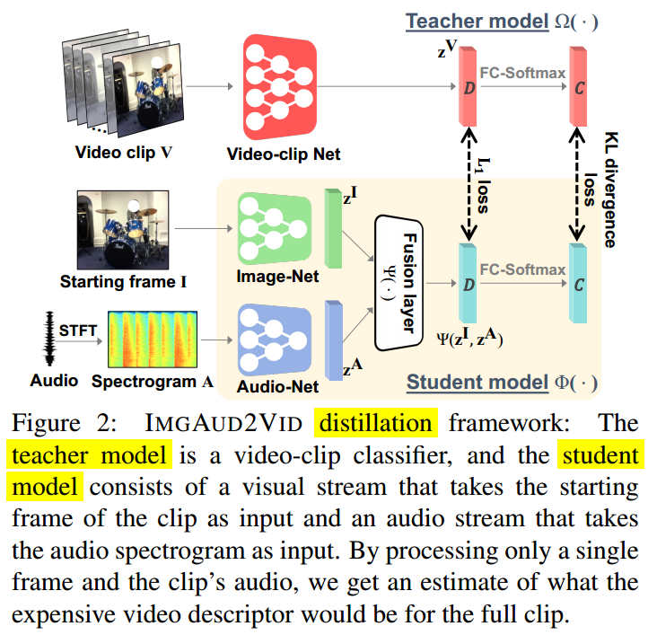
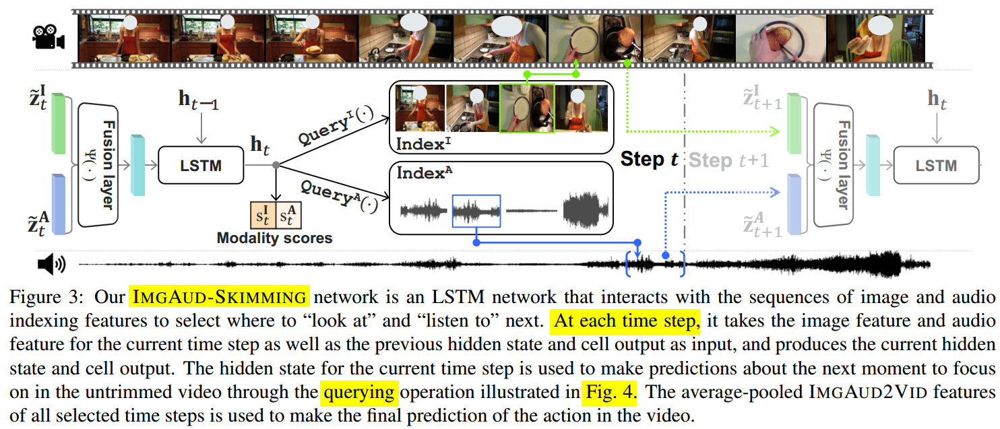
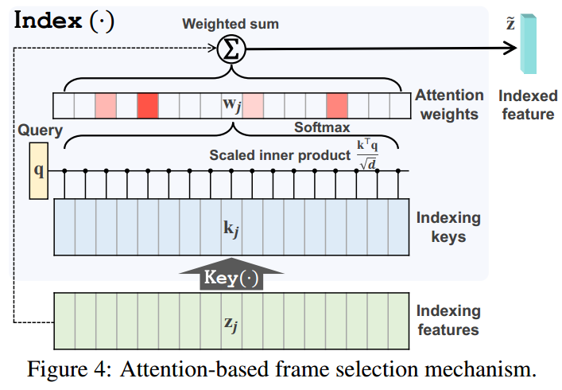

# Listen to Look

> Classifying long untrimmed videos using visual and audio modalities

[The paper.](https://arxiv.org/abs/1912.04487)
 - **Authors**: Ruohan Gao, Tae-Hyun Oh, Kristen Grauman, Lorenzo Torresani
 - **Published**: March 2020

<!-- TABLE OF CONTENT -->
## Table of Content
- [Listen to Look](#listen-to-look)
  - [Table of Content](#table-of-content)
  - [Introduction](#introduction)
  - [Architecture](#architecture)
    - [Problem Formulation](#problem-formulation)
    - [ImgAud2Vid](#imgaud2vid)
    - [ImgAudSkimming](#imgaudskimming)
  - [Experiments](#experiments)

<!-- Introduction -->
## Introduction
* Video classification
* Aims to handle redundancy in long video as well as within short clip
* ImgAud2Vid for short clip classification - uses 1 frame and clip audio
* ImgAud-Skimming for efficiently selecting useful moments for classifying whole video

<!-- Architecture -->
## Architecture

<!-- Problem Formulation -->
### Problem Formulation
* Given long untrimmed video $V$, classify it into predefined set of $C$ classes
* Traditional methods for long video classification followed following approach - 
  * Divide the video into short clips - {$V_1$, $V_2$, ...., $V_N$}
  * Classify each of the clips using all frames of that clip
  * Aggregate predictions from all clips based on confidence for video classification
* Problems - 
  * Long term temporal redundancy - Many clips of that video capture the same events
  * Short term temporal redundancy - Visual composition within the clip doesn't change much
* This paper handles both redundancy using audio preview
* Architecture consists of 2 main modules - ImgAud2Vid and ImgAud-Skimming

<!-- ImgAud2Vid -->
### ImgAud2Vid

* Teacher-student distillation framework
* Knowledge distillation - learns from pre-trained video clip classifier model *R(2+1)D-18*
* Classifies short clip from its **1st frame and clip-audio**
* The input to the network is short video clip
* **Teacher model** generates clip descriptor $z^V$ ($D$ dimensional) and then uses Fully Connected Layer for $C$ classes predictions
* **Student model** takes in $1st$ frame and clip audio as input
  * Generate image descriptor $z^I$ and audio descriptor $z^A$
  * Concatenate and get $D$ dimensional vector using fusion network (2 FC-Layers)
  * Get predictions for $C$ classes using FC-layer
* **Loss** - 
  * $L$$KL$ - loss based on softmax distibution of classes from teacher and student
  * $L_1$ - loss on the clip descriptor $z^V$ and the image-audio feature to regularize the learning process
  * Final loss = $L_1$ + $λL$$KL$
* The student model is then fine tuned on target dataset

<!-- ImgAudSkimming -->
### ImgAudSkimming

* Processing all clips is not efficient, hence this network selects subset of clips useful to classify the whole video
* Attention based LSTM model
* $h_t$, $c_t$ = LSTM($Ψ$($z^I$$t$, $z^A$$t$), $h$$t−1$, $c$$t−1$)
  * using image-audio descriptors, previous hidden state and cell output, get current hidden state and cell output
* Getting image and audio descriptors using indexing is **non-differentiable** (**DOUBT**)
* Differentiable soft -indexing mechanism - 
  * Predict image and audio query vectors ($q_t$$I$, $q_t$$A$) from hidden state $h_t$ using two prediction networks $Query^I$(.) and $Query^A$(.)
* Querying mechanism is illustrated in the figure below:
  * 
  * Transform descriptors to Key using FC-Layer
  * Calculate attention scores and apply softmax for weights
  * Calculate weighted feature vector independently for both audio and image
  * Repeat this for $T$ iterations and take average

<!-- Experiments -->
## Experiments
* Evaluated on Kinetics-Sounds, UCF-101, ActivityNet, and Mini-Sports1M
* ResNet-18 for image and audio descriptors
* Compared with various baselines and state-of-the-art methods
* In future work, they plan to investigate salient spatial region selection along with their temporal frame selection, which can potentially lead to finer granularity of action understanding with improved efficiency, as well as extensions to allow the multi-label setting