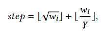
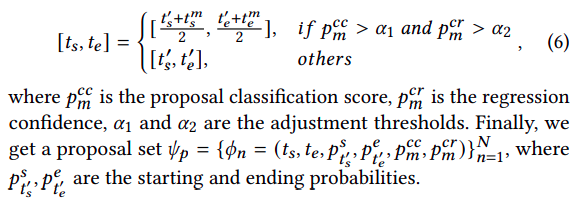
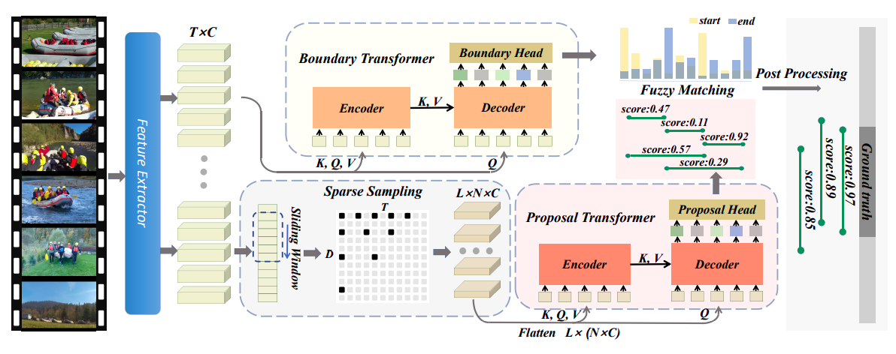

# Temporal Action Proposal Generation with Transformers
Temporal Action Proposal Generation: 
> Predict segments(proposals) in the video that correspond to an action. The segment includes the start and end time along with its confidence score.

[The paper.](https://arxiv.org/abs/2105.12043)

Recent paper - 2021 May. Achieves SOTA on both datasets used. 

## Features
- **TAPG Transformer** which consists of **Boundary Transformer** and **Proposal Transformer**.
- **Boundary Transformer** captures long-term temporal dependencies to predict precise boundary information.
- **Proposal Transformer** learns the rich inter-proposal relationships for reliable confidence evaluation.
- **Sparse Sampling Mechanism** to generate the sparse proposal sequence instead of the densely distributed proposals which will bring imbalanced data distribution between positive/negative proposals and more computational burdens.
- **Fuzzy Matching** is used to determine the proposals using the outputs of the Boundary Transformer and Proposal Transformer

## Datasets used
- ActivityNet-1.3
- THUMOS14 

## Preprocessing
1. Input: 
	- untrimmed video U can be denoted as a frame sequence U = {ut}t=1 lv with lv frames.
    - the temporal annotation set consists of n ground truth action instances each with a start time and end time.
2. Feature extraction:
    - The video U is divided into T = lv/sigma timesteps to decrease computation. 
    - These uniformly sampled segments are then fed into a feature extractor. 
    - The output consists of a feature sequence F = {fi}i=1 T which is fed into the network
    - The feature extractor used here is [Two-Stream Convolutional Networks for Action Recognition in Videos](https://papers.nips.cc/paper/2014/file/00ec53c4682d36f5c4359f4ae7bd7ba1-Paper.pdf) but we could use other ones such as ResNet or C3D too.

## Boundary Transformer
1. Encoder gets as input F ∈ RTxC and it outputs temporal features of the same dimension
2. Decoder gets the same input as the encoder but consists of cross attention with the output of the encoder
3. A feed forward NN(Boundary Head) gets as input the decoder's output. The sigmoid function is used at the last layer, consisting of 2 nodes(start time and end time). 
4. Thus, output is of dimension Tx2

## Proposal Transformer
1. Sparse Sampling mechanism is used first
    1. Fibonacci sequence is used to determine the group sizes for the sliding window W = {wi}i=1 D
    2. step size for each window is calulated as :
     
    where γ is used to constraint the step size increase with the increase in the window size.
    3. Weight matrix of shape NxT (N is the number of points sampled in a temporal region??(window??)) is multiplied with feature matrix of shape TxC to give CxN shaped proposal features. 
    4. The above step is done for L proposals, thus getting the proposal matrix of shape LxS (S = CxN flattended)
    5. LxS proposal features are fed into a transformer.
    6. The output of the decoder is given to a feed forward NN with sigmoid at the last layer. The last layer outputs 2 confidence scores
        1. Cc - used for binary classification loss
        2. Cr - used for regression loss

## Fuzzy Matching
1. Boundary transformer generates a set of proposals P consisting of start time and end time {ts, te}p
2. Fuzzy matching computes tIoU (temporal Intersection over Union) between proposal p and the sparse proposal generated by proposal transformer to select matching proposal {tms, tme}pm 
3. proposals are refined using :

4. Soft-NMS algorithm for Post-processing to remove the proposals which highly overlap with each other.

## Training
### Loss
1. L = Lb + Lp
2. Lb is the loss for boundary transformer
    1. Lb is split into separate losses for start and end time - Lb = Ls + Le
    2. Ls and Le - binary logistic loss(log loss)
2. Lp is the loss for proposal transformer
    1. Lp is split into separate losses for classification confidence and regression confidence - Lp = Lc + Lr
    2. Lc - binary logistic loss(log loss)
    3. Lr - smooth L1 loss

