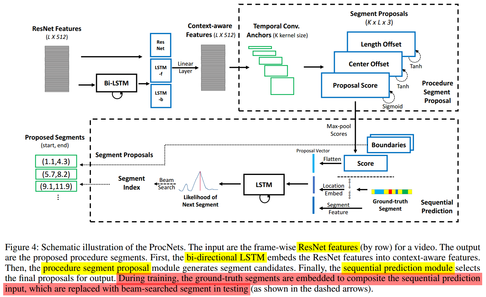
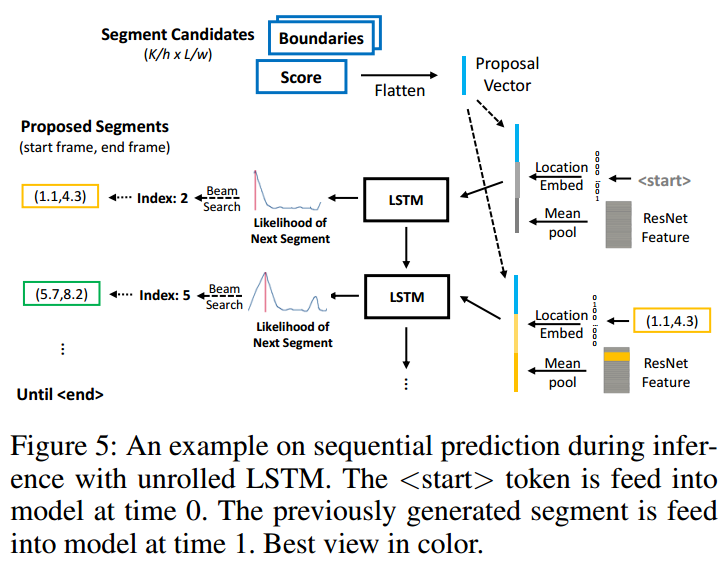
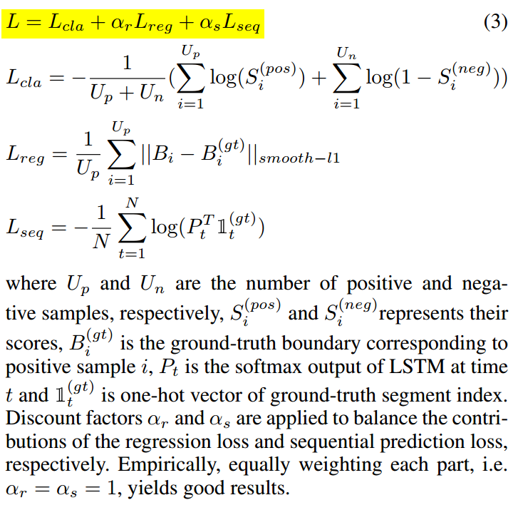

# Towards Automatic Learning of Procedures from Web Instructional Videos

> Generating proposals for procedural video

[The paper.](https://arxiv.org/abs/1703.09788)
 - **Authors**: Luowei Zhou, Chenliang Xu, Jason J. Corso
 - **Published**: November 2017

<!-- TABLE OF CONTENT -->
## Table of Content
- [Towards Automatic Learning of Procedures from Web Instructional Videos](#towards-automatic-learning-of-procedures-from-web-instructional-videos)
  - [Table of Content](#table-of-content)
  - [Introduction](#introduction)
  - [Architecture](#architecture)
    - [Problem Formulation](#problem-formulation)
    - [Context-Aware Video Encoding](#context-aware-video-encoding)
    - [Procedure Segment Proposal](#procedure-segment-proposal)
    - [Sequential Prediction](#sequential-prediction)
  - [Experiments](#experiments)

<!-- Introduction -->
## Introduction
* Procedure segmentation: segment a procedural video into category independent procedure segments
* Uses only video frames
* The human intuition:
  * first browse the video to have a general idea where are the salient segments - *proposal module*
  * finalize the segment boundaries based on the dependencies among the candidates - *sequential prediction module*

<!-- Architecture -->
## Architecture

<!-- Problem Formulation -->
### Problem Formulation
* ProcNets have three pieces:
  * context-aware frame-wise feature **encoding**
  * procedure segment proposal for localizing segment **candidates** as start and end timestamps
  * sequential prediction for learning the temporal structure among the candidates and generating the **final proposals** through a RNN

<!-- ContextAwareVideoEncoding -->
### Context-Aware Video Encoding

* Video x = {x1, x2, ...., xL}
  * *L* is number of sampled frames (L = 500)
  * *xi* is framewise ResNet feature vector (dim = 512)
* Features are passed through Bi-LSTM and the outputs are concatenated with ResNet feature at each frame

<!-- ProcedureSegmentProposal -->
### Procedure Segment Proposal

* Inspired by anchor-offset mechanism
* K explicit anchors
* Temporal convolution on context aware features gives proposal score, center offset and length ofset
* Proposal generation as classification problem and proposal offset as regression problem

<!-- SequentialPrediction -->
### Sequential Prediction

* LSTM with input
  * Proposal vector S: max-pooled proposal scores (**how good they are**)
  * Location embeddings Bt: set of vectors that discretely encode the locations of ground truth or previously generated segments (**target candidates**)
  * Segment Content Ct: visual features of ground truth or previously generated segments (**what they look like**)
* Output is likelihood of each proposal being the next segment prediction
* Beam search on the likelihood
* During inference beam search index = 1 yields best results

---

* Loss is combination of all three modules

<!-- Experiments -->
## Experiments
* Evaluated on YouCook2 with Jaccard and mean IoU metrics
* Compared with video Summarization LSTM, Segment CNN for proposals
* Does not work on permutation of video (i.e. inversion of video segments)
* Future work
  * Dense video captioning
  * Weakly supervised segmentation, which is to first align the weak audio/subtitle signal with the video and then train the model with the aligned annotation