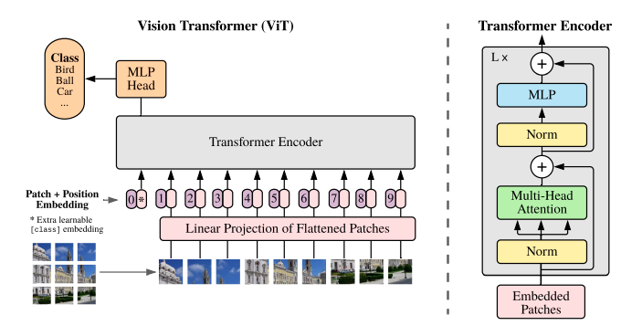

# An image is worth 16x16 words: Transformers for image recognition at scale
## (Vision Transformer - ViT)

[The paper.](https://arxiv.org/abs/2010.11929)

## Abstract
- Transformer encode architecture for images.
- It use nxn patches of images (patch embeddings) as input to the transformer (similar to word embeddings).
- Comparable with CNNs if pre-trained on large amounts of data.

### Dataset: 
- SOTA on lots of standard image classification datasets such as ImageNet, CIFAR, etc.
- Also uses datasets such as [VTAB](https://ai.googleblog.com/2019/11/the-visual-task-adaptation-benchmark.html)
that consists of 19 downstream comuter vision tasks.

## Architecture

1. **Input**: The input is an flattened nxn patches of an image. 
	- Original image is x ∈ RH×W×C 
	- This is converted to a flattened 2D patch xp ∈ RNx(P2.C)
	- HxW is the resolution of the image, C is the number of channels, **PxP is the resolution of each patch**.
	- N=HW / P2. This is the resulting number of patches (or the **effective sequence length** - analogous to the number of words in a sentence). These are the patch embeddings.
	- Position embeddings are added to the above patch embeddings. These can be:
		1. 1D, like in transformers.
		2. 2D, based on row and column indices.
		3. Relative distance between patches to encode the spatial information instead of their absolute position.
	- Addition of position embeddings can also be varied.
	- A learnable classification [<i>class</i>] token is prepended to the image sequence like the BERT model. z0 is the input [<i>class</i>] token and zl is the output. zl serves as the image representation for downstream tasks. 
	- These embeddings are mapped onto a D-dimensional space which is common across the encoder.

2. **Hybrid Architecture**: CNN feature maps can be used as patch embeddings instead of orignal images patches. 

3. **Training**: Pretrained on datasets such as ImageNet, ImageNet-21k, JFT-300M for better performance. 

	- Adam optimizer with β1 = 0.9, β2 = 0.999, batch size of 4096 and a high weight decay of 0.1.

	- Strong regularization. Dropout, when used, is applied after every dense layer except for the the qkv-projections and directly after adding positional information to patch embeddings.

	- Training is done on a reolution of 224 (14x14)

	- Can also be pretrained using masked tokens like in BERT (self-supervision).

