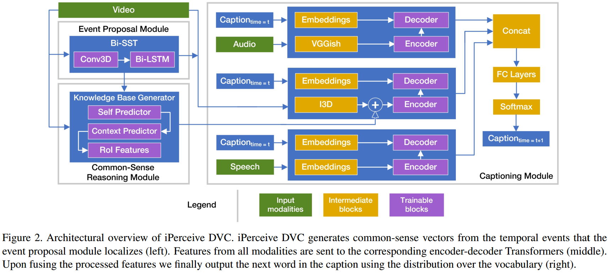
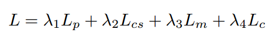

# iPerceive: Applying Common-Sense Reasoning to Multi-Modal Dense Video Captioning and Video Question Answering

> DVC with main focus on reducing cognitive error and attending to objects

[The paper.](https://arxiv.org/abs/2011.07735)
 - **Authors**: Aman Chadha, Gurneet Arora, Navpreet Kaloty
 - **Published**: November 2020

<!-- TABLE OF CONTENT -->
## Table of Content
- [iPerceive: Applying Common-Sense Reasoning to Multi-Modal Dense Video Captioning and Video Question Answering](#iperceive-applying-common-sense-reasoning-to-multi-modal-dense-video-captioning-and-video-question-answering)
  - [Table of Content](#table-of-content)
  - [Introduction](#introduction)
  - [Architecture](#architecture)
    - [Problem Formulation](#problem-formulation)
    - [Event Proposal Module](#event-proposal-module)
    - [Common Sense Reasoning Module](#common-sense-reasoning-module)
    - [Captioning Module](#captioning-module)
  - [Experiments](#experiments)

<!-- Introduction -->
## Introduction
* Dense video captioning and Video question answering
* Aims to understand the "why" between the events **P(Y | do(X))** by handling 
  * cognitive error - giving importance to past events which leads to future events
  * incorrect attention - attending to every major object in the frame (eg. recognizing oven from cooking video)
* Uses video frames, audio and speech text in **end to end manner**
* Code and samples are available at: [amanchadha/iPerceive](https://github.com/amanchadha/iPerceive)

<!-- Architecture -->
## Architecture

<!-- Problem Formulation -->
### Problem Formulation
* **Event Proposal Module**: Temporally localize a set of events in a video
* **Common Sense Reasoning Module**: Build a knowledge base for common sense reasoning
* **Captioning Module**: Produce textual description using audio, video and speech cues for each event

<!-- EventProposalModule -->
### Event Proposal Module

* Bidirectional Single Stream Network (Bi-SST)
* Applies 3D convolutions to video frames and passes on the extracted features to a Bi-directional LSTM network
* Output is the endpoints of each event along with its confidence score

<!-- CommonSenseReasoningModule -->
### Common Sense Reasoning Module

* Input is the events localized
* Used for encoding visual features of the event
* Determines causality: P(Y | do(X)) using borrow-put experiment:
  * **“borrow”** non-local context, say an object Z from another event, 
  * **“put”** Z in the context of object X and object Y 
  * test if object X still causes the existence of object Y given Z
  * This helps in determining if the chance of Z is independent on X and Y
  * **Z** is fixed set of confounder objects from MS-COCO dataset (averaged features for object ROI)
  * **X** is the center object
  * **Y** is the center's context
* ROI's are generated using pre-trained Mask R-CNN
* Also the features are generated only for frames where the environmental settings differ from its previous one
* **Self-predictor** predicts class of center object X
* **Context-predictor** to predict the “center” object’s context labels Y
* The features generated by this module are then paired with corresponding visual features and sent to captioning module

<!-- CaptioningModule -->
### Captioning Module

* Given an event proposal and its common-sense vectors, the captioning module generates a caption using audio, visual and speech modalities
* Transformer-based architecture
* Omits the self-multi-head attention component since it applies P(Y | X) rather than the main motive P(Y | do(X))
* You can refer the loss equations for each module. The final loss is given as:

<!-- Experiments -->
## Experiments
* Evaluated on ActivityNet Captions with BLEU@N and METEOR metrics
* Compared with Krishna et al Dense-captioning events in videos, Wang et al Bidirectional attentive fusion with context gating for
DVC, Zhou et al end-to-end dense video captioning with masked transformer and Li et al Jointly localizing and describing events for dense video captioning
* Compared with various baselines and state-of-the-art methods